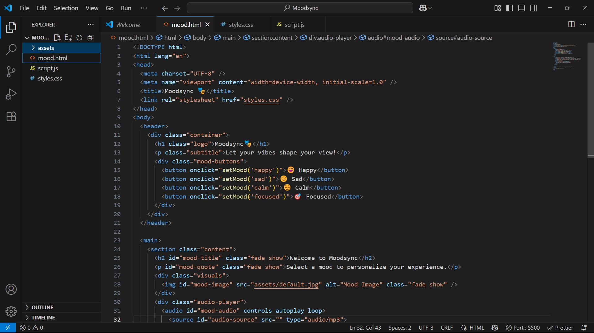
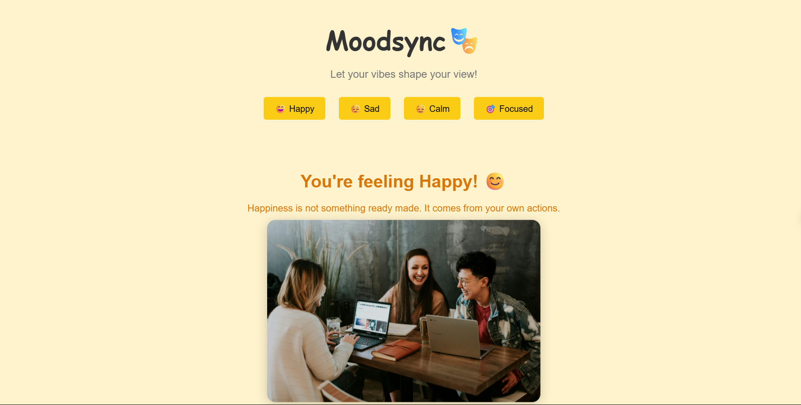

### 🎭 MoodSync - Mood-Based Personal Web Experience
MoodSync is an interactive and responsive web page that dynamically adapts its visual and audio interface based on the user’s selected mood — offering an immersive vibe-driven experience. This project demonstrates HTML, CSS, and JavaScript skills including DOM manipulation, responsive design, interactivity, and smooth animations.

### 🌟 Features

* 🎨 **Mood Themes** – Choose from Happy, Sad, Calm, Focused, and more.
* 🖼️ **Dynamic Visuals** – The background and main image reflect your mood.
* 🎵 **Mood Music** – Audio updates with each mood (MP3s required).
* ✨ **Smooth Transitions** – Fade-in/fade-out animation on content change.
* 💡 **Minimal UI, Maximum Feel** – Clean layout to highlight emotions.
* 📱 **Responsive Design** – Looks great on all screen sizes.

### 🧱 Folder Structure

```
Moodsync/
│
├── mood.html              # Main HTML file
├── styles.css             # All mood styling and themes
├── script.js              # JavaScript logic for interaction
├── README.md              # Project info and usage guide
│
└── assets/                # (Add your mood images & music here)
    ├── happy.jpg / .mp3
    ├── sad.jpg / .mp3
    ├── calm.jpg / .mp3
    ├── focused.jpg / .mp3
    ├── default.jpg
```
---

### 🚀 How to Use

1. Download or clone this repo:

   ```bash
   git clone https://github.com/your-username/moodsync.git
   cd Moodsync
   ```

2. Add mood-specific `.jpg` and `.mp3` files inside the `assets/` folder.

3. Open `mood.html` in any browser.

4. Click a mood button to see the transformation in real-time!

---

### 📸 Preview

https://www.loom.com/share/56669cf507424b70b43b6b51d520972f?sid=eadfc514-3a7f-465f-aed7-435a805844f4

---
## 🖼️ MoodSync Previews

### 🧑‍💻 Code Overview


### 🏠 MoodSync Homepage


---

### 🛠️ Built With

* **HTML5** – for structure and semantics
* **CSS3** – for layout, theming, and animations
* **JavaScript** – for interactivity and mood logic

---

### 📌 Future Improvements

Here are some great enhancements that can take MoodSync to the next level:

* 📥 **Local Storage Support** – Remember user's last selected mood across sessions.
* 🎯 **Expanded Mood Library** – Add more moods like “Motivated”, “Relaxed”, “Romantic”, etc.
* 🌈 **Unique Layouts per Mood** – Different UI structures for each vibe (e.g., grid, flex, full-screen).
* 💬 **Live Mood Quotes API** – Fetch quotes dynamically based on mood.
* 🎧 **Spotify Integration** – Pull mood playlists using Spotify Web API.
* 💡 **Mood Prediction via AI** – Use webcam/emotion AI or text sentiment analysis to auto-detect mood.
* 📊 **Mood Tracker** – Chart how often each mood is selected (daily/weekly).
* 🌐 **PWA Support** – Make MoodSync installable as a mobile web app.
* 🧩 **Drag and Drop Mood Customizer** – Let users upload their own image/music per mood.
* ⚙️ **Settings Panel** – Custom mood toggle, volume, auto-play, and theme selector.
* 🌟 **Particles / Emoji Rain** – Visual effects based on selected mood.
* 🌈 **Animated Emoji Backgrounds** – Bring pages to life with motion effects.

---

### 👨‍💻 Author

**Panvit Banda**
🎓 B.Tech Final Year Student | Web & AI Enthusiast
📬 [LinkedIn](https://www.linkedin.com/in/panvit-banda/)
💻 [GitHub](https://github.com/PanvitBanda)

---

### 📄 License

This project is open-source and available under the [MIT License](./Moodsync/LICENSE).

---
